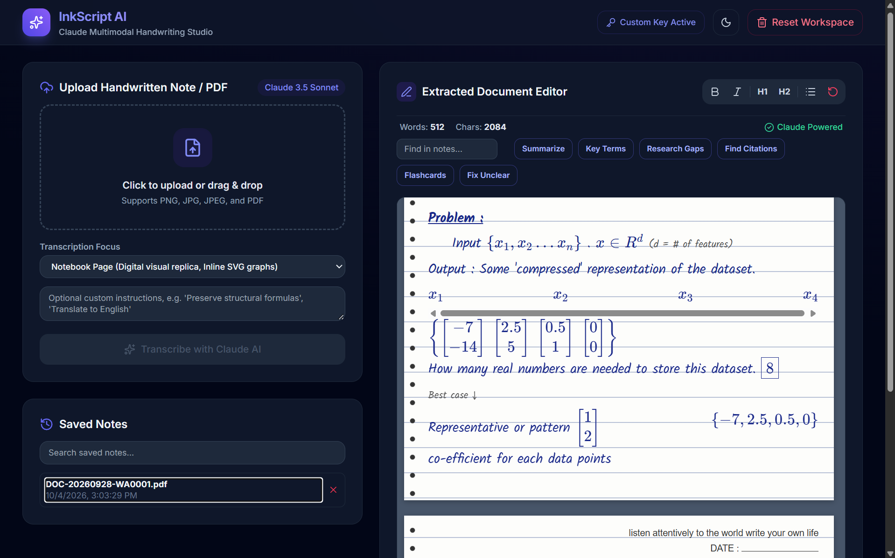

# InkScript AI (Claude Multimodal Edition) — Project README

InkScript AI is a modern, high-performance research and handwriting transcription studio built to extract messy handwritten notes, mathematical equations, tables, and structural diagrams into polished digital notebooks, Markdown, or clean PDF documents using Anthropic's **Claude 5.5** Vision model.

---



## Key Features

* **Multimodal Handwriting Extraction:** Powered by Claude 3.5 Sonnet to accurately transcribe cursive or print handwriting from images (`PNG`, `JPG`, `JPEG`) and multi-page PDF documents.
* **Mathematical Rendering (KaTeX):** Automatically parses and formats inline (`$...$`) and block (`$$...$$`) LaTeX equations.
* **Structural Diagram Reconstruction (Mermaid.js):** Translates hand-drawn flowcharts, graphs, and trees into clean, renderable Mermaid.js diagrams or inline SVGs.
* **Digital Notebook Mode:** Recreates a visual replica of ruled notebook pages complete with marginal indentation, custom headers, and retro styling.
* **Native PDF & Markdown Export:** Instantly compile your edited documents into standard Markdown (`.md`), HTML notebooks, or print-ready PDFs without losing styling.
* **Built-in AI Assistant & Action Suite:** One-click tools to generate executive summaries, extract key terms, find research gaps, build flashcards, and query your notes directly.
* **Secure Local Proxy Architecture:** Bypasses browser-level CORS restrictions and connection resets via a lightweight Python local server proxy.

---

## Tech Stack

* **Frontend:** HTML5, Tailwind CSS, JavaScript (ES6+), Lucide Icons, Google Fonts (*Inter*, *JetBrains Mono*, *Kalam*).
* **Rendering & Parsing Engines:** Marked.js, DOMPurify, KaTeX, Mermaid.js, PDF.js.
* **Backend Proxy:** Python (`http.server`, `urllib`).
* **AI Model:** Anthropic Claude 3.5 Sonnet (`claude-3-5-sonnet-20241022`).

---

## Project Structure

```text
Project Jennifer/
│
├── inkscript_ai_claude.html   # Main application frontend UI and client-side logic
├── server.py                  # Local Python server and API CORS proxy
└── README.md                  # Project documentation

```

---

## Getting Started & Installation

1. **Prerequisites:**
Ensure you have Python 3 installed on your system. No external Python pip packages are required since the server relies entirely on standard libraries.


2. **Clone or Open Project Folder:**
Open your terminal or PowerShell and navigate to your project directory:

```powershell
cd "C:\Users\Pratham Prajapati\Machine Learning Projects\Project Jennifer"

```


3. **Start the Local Server:**
Run the Python proxy server script:

```powershell
python server.py

```

*The terminal will output:* `Studio running at http://localhost:8080/inkscript_ai_claude.html`


4. **Launch in Browser:**
Open your browser and navigate to:
`http://localhost:8080/inkscript_ai_claude.html`


---

## Usage Guide

1. **Configure Your API Key:** Click the **API Key Configured** button in the top navigation bar to enter your Anthropic Claude API key (`sk-ant-...`). Your key is saved securely in your browser's local storage.
2. **Upload a Document:** Drag and drop or click to upload a handwritten image or multi-page PDF document into the drop zone.
3. **Select Transcription Focus:**
* *Notebook Page:* Renders a visual digital notebook replica with inline SVG graphs.
* *Clean & Formatted Notes:* Organizes output using Markdown headings and Mermaid.js graphs.
* *Verbatim / Summary / Research / Structured:* Specialized extraction profiles based on your workflow.


4. **Edit & Enhance:** Use the rich text editor tools to modify your notes, fix formatting, or click AI action buttons (*Summarize*, *Key Terms*, *Research Gaps*, *Flashcards*) to analyze the content.
5. **Export:** Click **Download PDF** to trigger a clean print dialog, download the file as Markdown (`.MD`), or save it directly to your browser's local library.